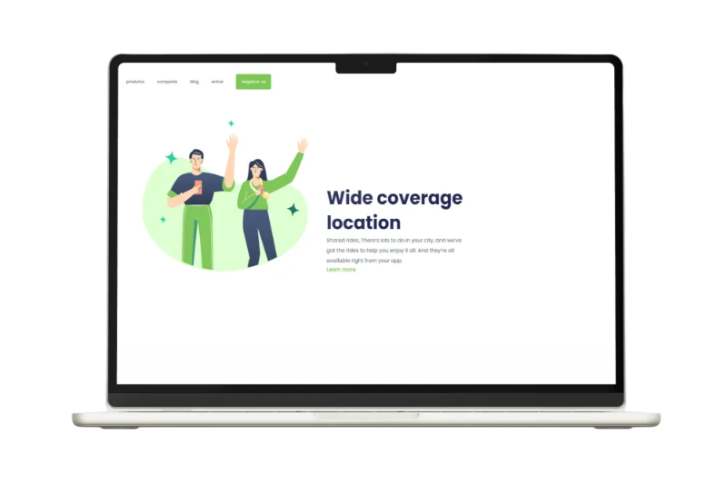

# Wide-Coverage

Este projeto é uma **landing page responsiva** de uma pagina de localização de ampla cobertura, criado como parte da minha jornada de aprendizado em desenvolvimento
web. O objetivo era aumentar o conhecimento e a experiencia sobre HTML5, CSS e sobre responsividade.

## 📸 Page-Preview

## 👷🏻‍♀️ Tecnologias Utilizadas

- HTML
- CSS

### 🚀Características

- Celular & Desktop Layouts
- Html Semantico

## 👩🏻‍💻 Autor

&nbsp;&nbsp;
&nbsp;&nbsp;
